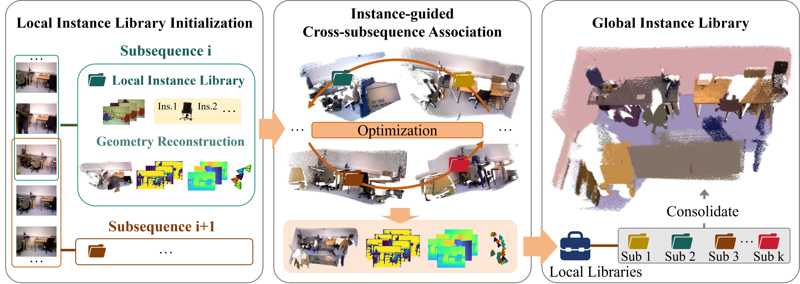
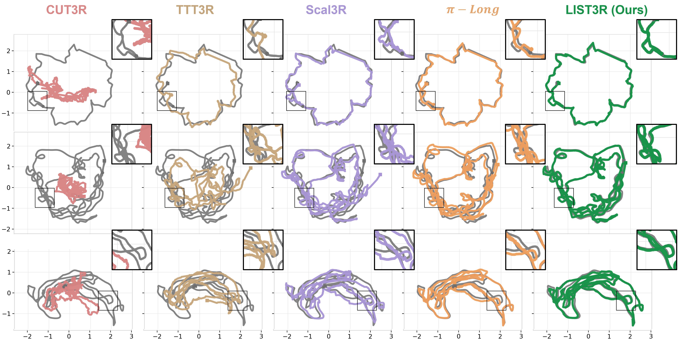

# LIST3R: Long-sequence Instance-aware 3D Reconstruction

<p align="center">
  <a href="https://yixn965.github.io/">Jing Gao</a> &nbsp;·&nbsp;
  <a href="https://weiwangtrento.github.io/">Wei Wang</a> &nbsp;·&nbsp;
  <a href="https://brack-wang.github.io/">Feiran Wang</a> &nbsp;·&nbsp;
  <a href="https://tomyan555.github.io/">Yan Yan</a>
</p>

<p align="center">
  <a href="https://arxiv.org/abs/2607.00375"><strong>arXiv</strong></a> |
  <a href="https://github.com/yixn965/LIST3R"><strong>Code</strong></a> |
  <a href="https://yixn965.github.io/LIST3R/"><strong>Project Page</strong></a>
</p>

<p align="center">
  
</p>

We present **LIST3R**, an instance-aware framework for long-sequence 3D reconstruction. LIST3R uses persistent object instances as anchors to reconnect fragmented subsequences, recover long-range revisits, and consolidate local observations into a coherent global 3D scene.

## Method Overview

<p align="center">
  
</p>

LIST3R builds a local instance library for each subsequence, establishes cross-subsequence associations with instance-aware constraints, and consolidates local instance observations into a unified global 3D instance library.

## Quantitative Analysis

Camera pose estimation on long sequences. ATE / RTE are reported in meters, RRE in degrees. Lower is better.

| Method | TUM ATE ↓ | TUM RTE ↓ | TUM RRE ↓ | ETH3D ATE ↓ | ETH3D RTE ↓ | ETH3D RRE ↓ | BONN ATE ↓ | BONN RTE ↓ | BONN RRE ↓ |
| --- | ---: | ---: | ---: | ---: | ---: | ---: | ---: | ---: | ---: |
| CUT3R | 0.866 | 0.963 | 40.19 | 2.895 | 2.537 | 43.04 | 0.319 | **0.561** | 58.13 |
| TTT3R | 0.317 | 0.385 | 9.92 | 1.317 | 0.939 | 10.33 | 0.149 | 0.759 | 47.51 |
| VGGT-Long | 0.325 | 0.489 | 25.21 | 1.292 | 1.701 | 32.92 | 0.123 | 0.787 | 47.43 |
| π-Long | 0.208 | 0.279 | 7.81 | 0.562 | 0.455 | 13.65 | 0.094 | 0.770 | 48.01 |
| Scal3R | 0.267 | 0.329 | **5.72** | 0.807 | 0.590 | **7.00** | 0.117 | 0.779 | 49.09 |
| **LIST3R (Ours)** | **0.150** | **0.211** | 6.97 | **0.516** | **0.444** | 9.32 | **0.085** | 0.779 | **45.89** |

<p align="center">
  
</p>

Point cloud reconstruction quality. Chamfer / Acc / Comp are reported in centimeters. Lower is better for Chamfer / Acc / Comp, and higher is better for NC / F@5.

| Method | ETH3D Chamfer ↓ | ETH3D Acc ↓ | ETH3D Comp ↓ | ETH3D NC ↑ | ETH3D F@5 ↑ | NRGBD Chamfer ↓ | NRGBD Acc ↓ | NRGBD Comp ↓ | NRGBD NC ↑ | NRGBD F@5 ↑ |
| --- | ---: | ---: | ---: | ---: | ---: | ---: | ---: | ---: | ---: | ---: |
| CUT3R | 140.0 | 62.8 | 217.3 | 0.536 | 4.0 | 73.2 | 50.1 | 96.4 | 0.575 | 9.0 |
| TTT3R | 102.6 | 36.6 | 168.6 | 0.610 | 7.3 | 41.3 | 26.2 | 56.4 | 0.647 | 22.2 |
| VGGT-Long | 50.6 | 56.7 | 44.4 | 0.618 | 19.8 | 6.1 | 5.3 | 6.9 | 0.857 | 68.9 |
| π-Long | 41.5 | 37.8 | 45.3 | 0.686 | 32.7 | 5.0 | 4.4 | 5.5 | **0.876** | 68.9 |
| Scal3R | 33.8 | 36.5 | 31.1 | 0.658 | 26.2 | 7.7 | 4.2 | 11.1 | 0.829 | 71.2 |
| **LIST3R (Ours)** | **27.4** | **31.1** | **23.6** | **0.709** | **36.5** | **4.7** | **4.1** | **5.3** | 0.875 | **73.4** |

<p align="center">
  
</p>

## Citation

```bibtex
@article{gao2026list3r,
  title={LIST3R: Long-sequence Instance-aware 3D Reconstruction},
  author={Gao, Jing and Wang, Wei and Wang, Feiran and Yan, Yan},
  journal={arXiv preprint arXiv:2607.00375},
  year={2026}
}
```
